# QT_openBrowser

## 介绍
基于QT      一个开源的文件浏览器  
目前支持  
.dcm .mha .mhd 
.stl *.ply *.vtkxml *.vtp *.vtk
.bmp .jpg .pbm .pgm .png .ppm .xbm .xpm  
等文件的浏览和前处理  


## 特性
程序主要来自网络整理，便于自己和他人使用。 
所有模块均采用manager管理，从程序中分割非常方便。  
其他功能持续增加维护，比如opencv与QT结合使用、QT+Halcon使用、QT下文本编辑器等  
我的使用的版本见下方安装教程，由于能力有限，仅维护测试ubuntu下程序，windos下需要自己简单修改就可以。  
每一个模块采用manager进行管理(事件驱动),非常容易分离,便于拆去单独使用!!  

## 参考  
https://me.csdn.net/feiyangqingyun   feiyangqingyun   QT自定义控件教程   
https://gitee.com/feiyangqingyun   feiyangqingyun   QT自定义控件教程     
https://blog.csdn.net/webzhuce  阿兵-AI医疗  VKT中文教程  
https://blog.csdn.net/u013165921 笔尖bj opencv+qt结合   
https://me.csdn.net/u011012932  一去丶二三里   QT常用控件基础  
https://doc.cgal.org/latest/Manual/index.html  CGAL 官方教程  
https://lorensen.github.io/VTKExamples/site/Cxx/#surface-reconstruction  VTK  官方教程  
https://itk.org/Doxygen/html/index.html  ITK  官方教程  
https://doc.qt.io/ qt 官方教程  

## 展示
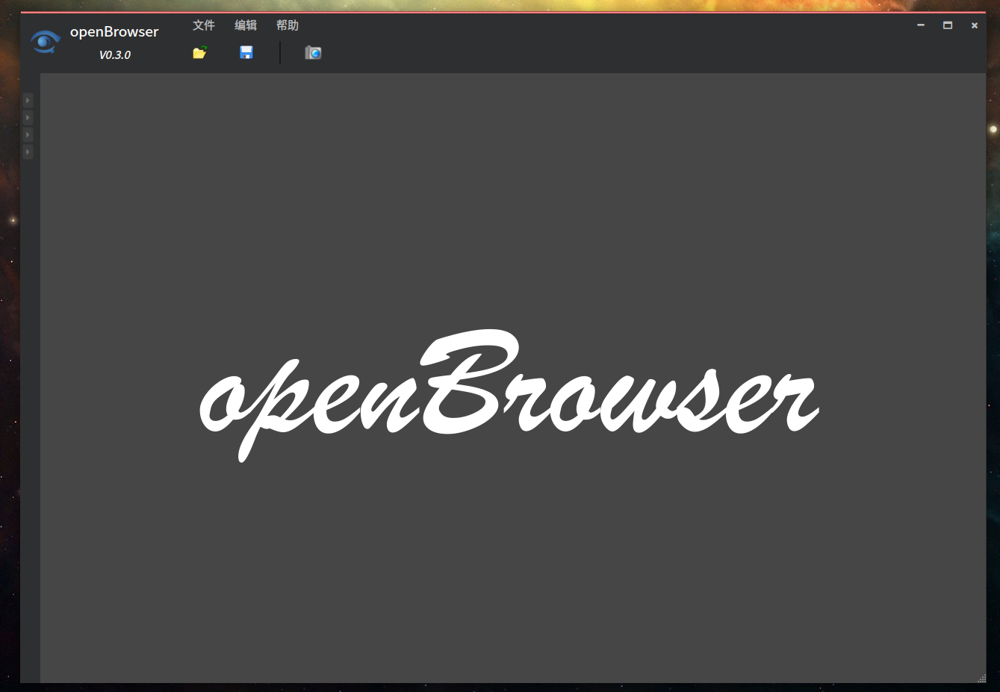
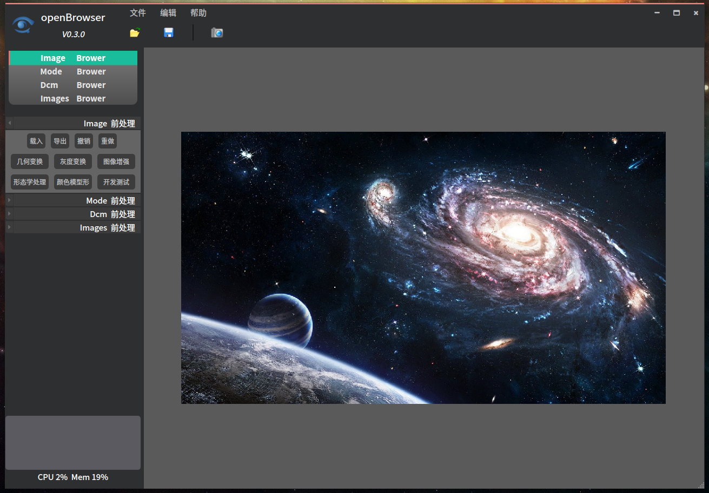
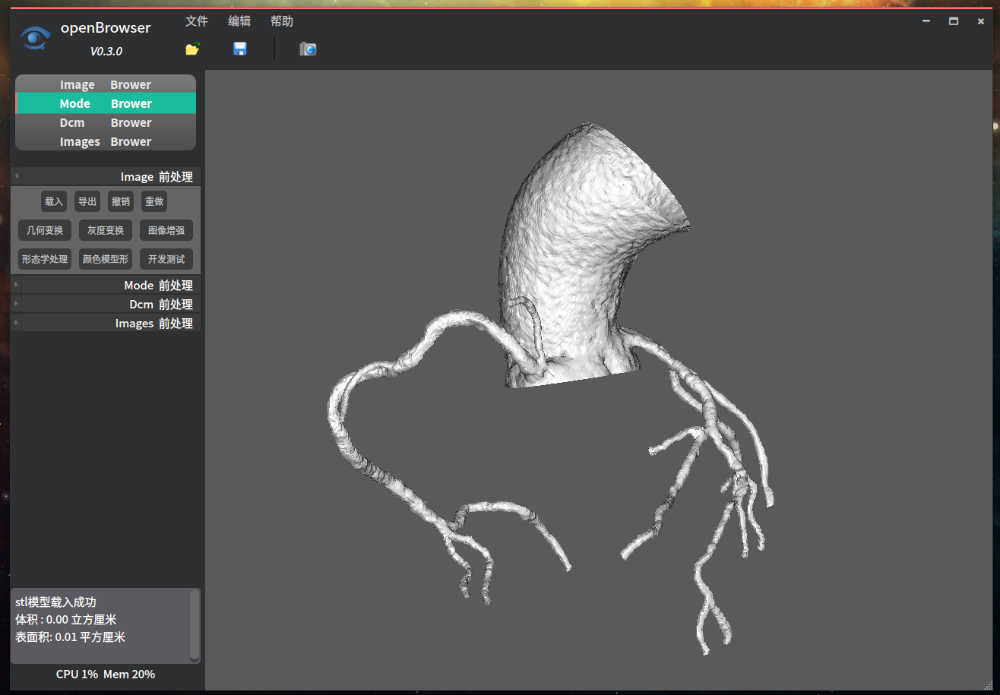
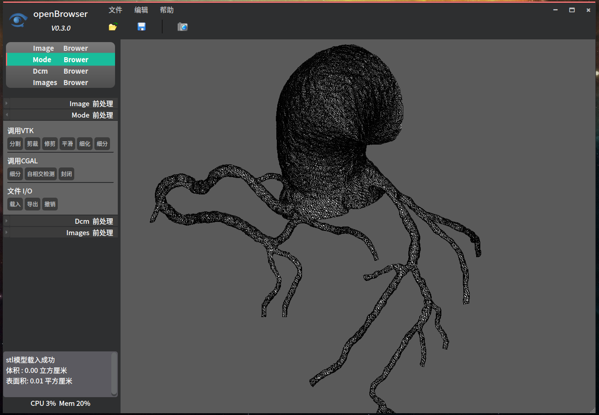
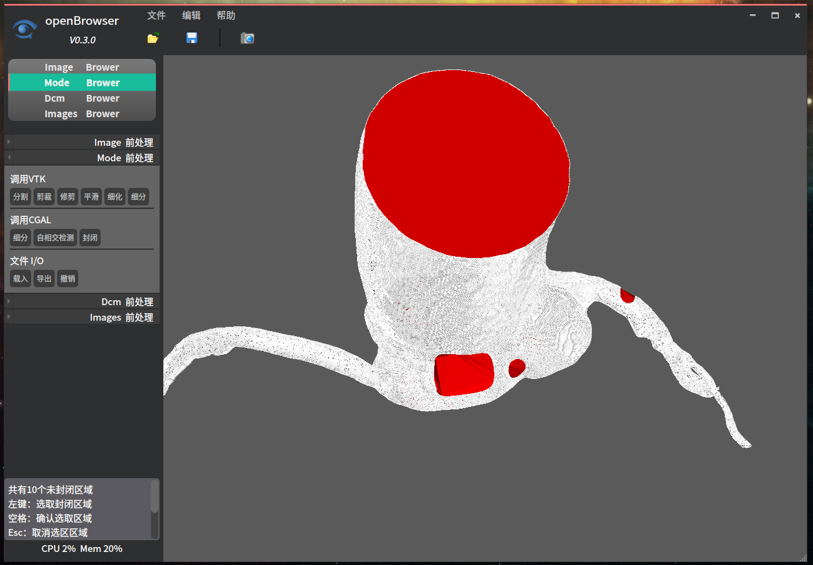
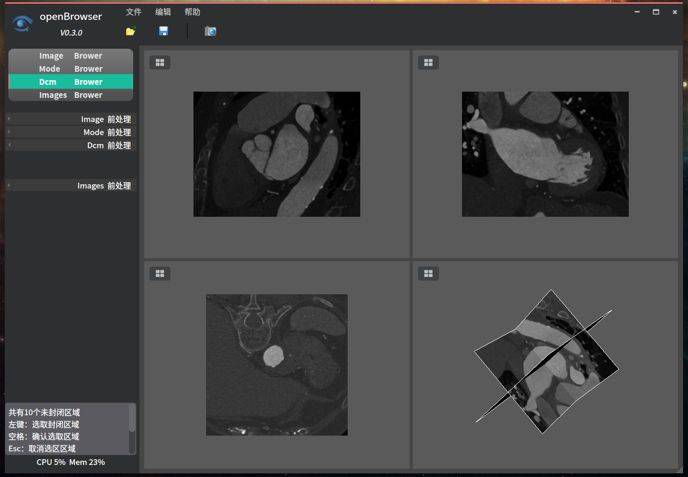
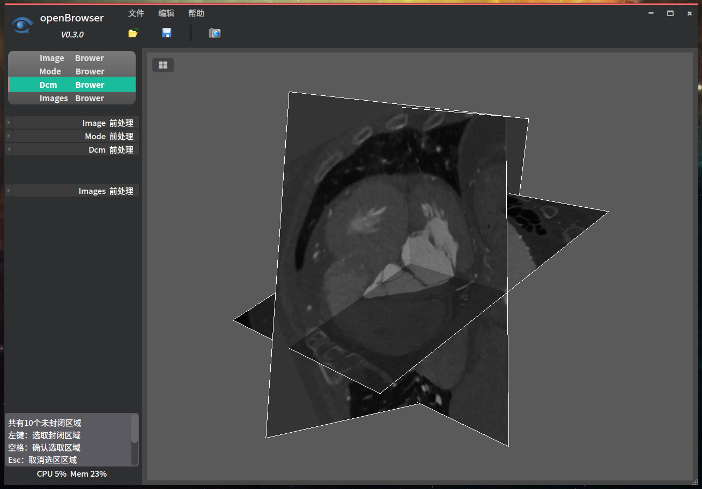
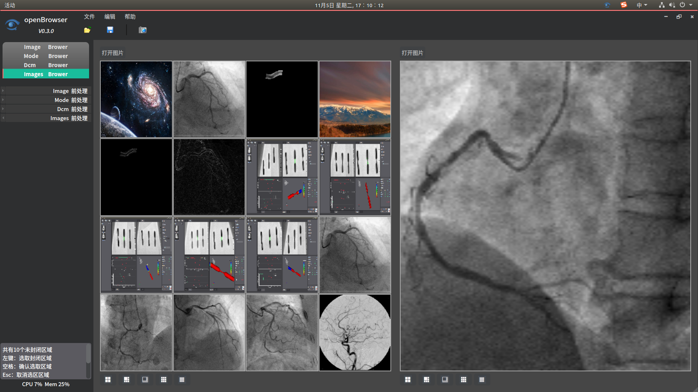
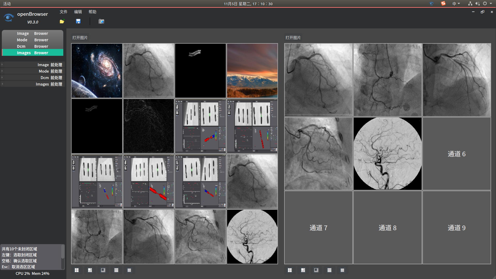
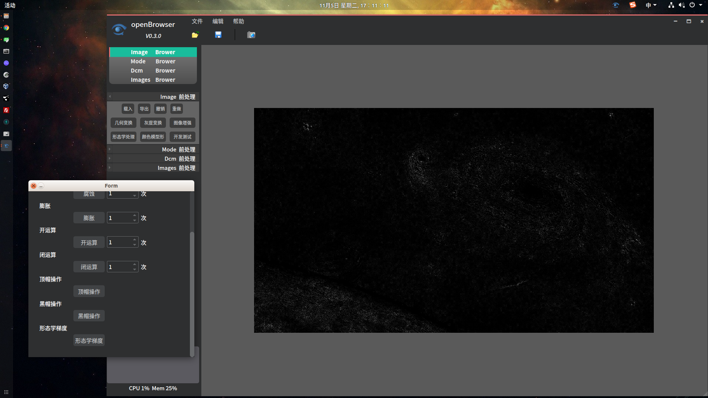
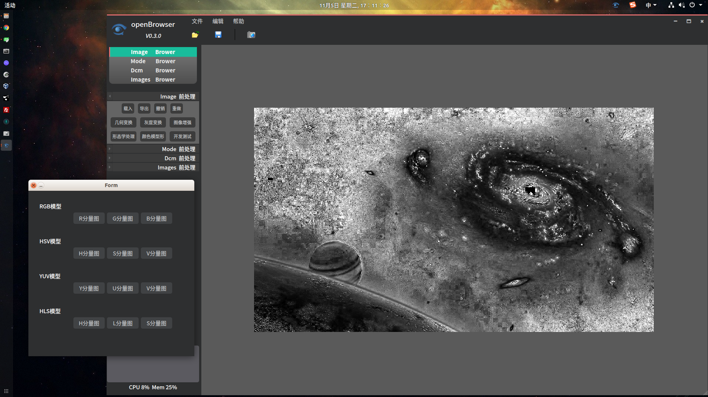
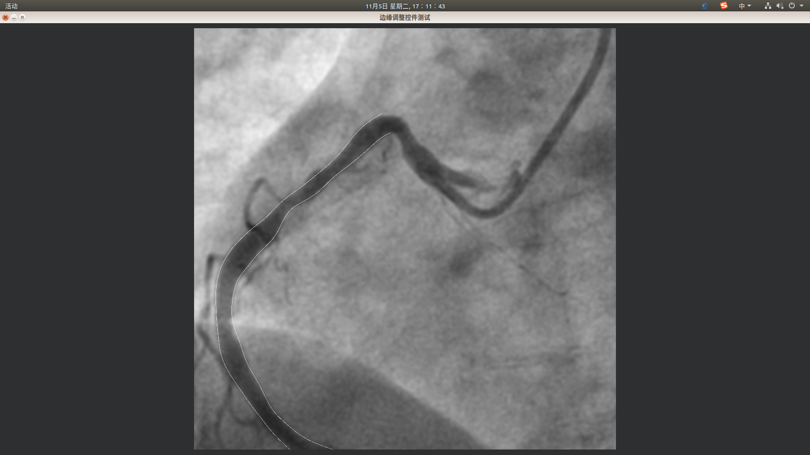
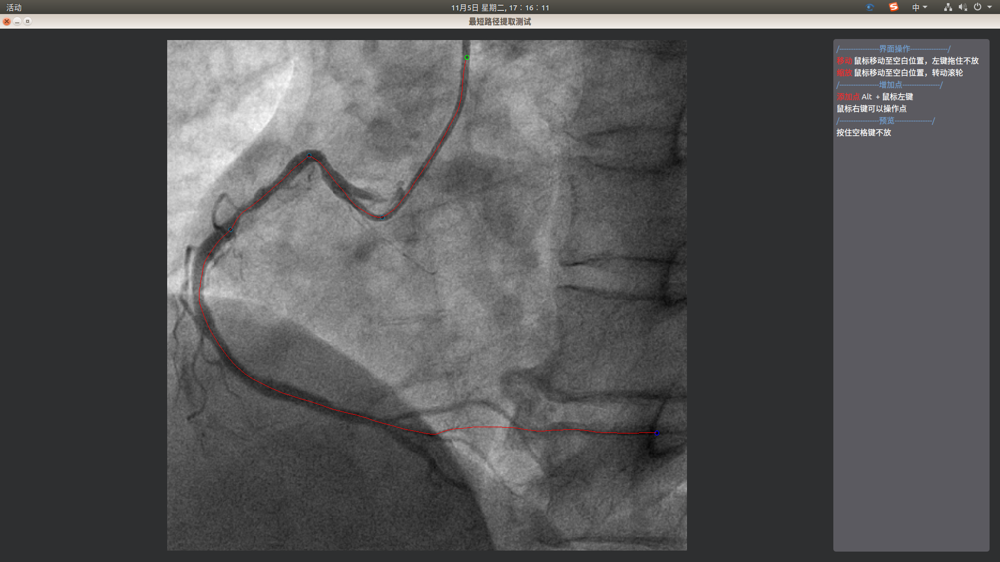
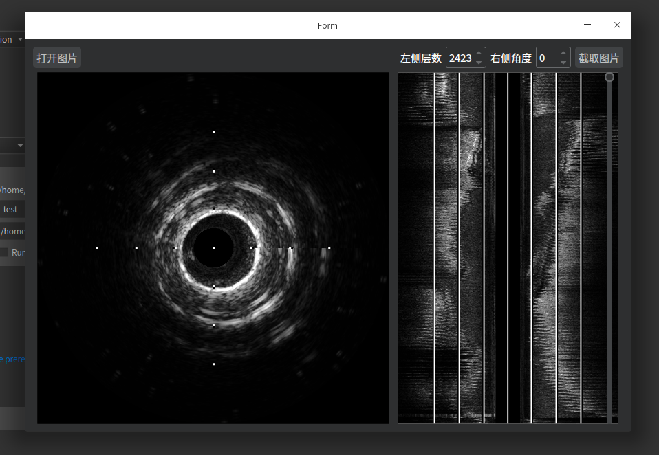


## 代码风格
Artistic Style

--style=google
indent=spaces=4	          # 缩进采用4个空格  
indent-switches           # -S  设置 switch 整体缩进  
indent-cases 	          # -K  设置 cases 整体缩进  
indent-namespaces         # -N  设置 namespace 整体缩进  
indent-preproc-block      # -xW 设置预处理模块缩进  
indent-preproc-define     # -w  设置宏定义模块缩进  
pad-oper                  # -p  操作符前后填充空格  
pad-header                # 在if，for，while等代码段前后增加空行  
unpad-paren               # 备份文件的后缀，默认是.orig,=none表示不进行备份  
delete-empty-lines        # -xe 删除多余空行,调试时候并未使用,提交前使用一次  
add-braces                # -j  单行语句加上大括号  
align-pointer=name        # *、&这类字符靠近变量名字  

## 命名格式
```cpp
class ImageBrowserManager: public QObject {
    Q_OBJECT
  public:
    explicit ImageBrowserManager(QOpencvWidget &widget,
                                 QObject *parent = nullptr);
    virtual ~ImageBrowserManager() override;
    void OpenStlFile(const QString &file_path = "");
  public Q_SLOTS:
    void SlotImgProcess(const int &operation, const QString &text);
  Q_SIGNALS:
    void SignalPromptInformationOut(const QString &text);
  private:
    void Initial();
    void UnDo();
    void ReDo();
    void UpDataImage(const QImage);

  private:
    QOpencvWidget &widget_;
    QVector<QImage> img_vector_;	                // 存储图像的Vector容器
    QVector<QImage>::iterator imt_iter_;		// Vector迭代器
};
```

## 软件架构
分层架构和事件驱动型  
主要包括四个模块 
Mode 
Image 
Dcm 
Images


## 文件结构  
/preview  ................................................运行截图  
/Source   .................................................程序源码  
.gitignore  ................................................git忽略文件  
CMakeLists.txt  .......................................cmake配置文件  
Pack.sh  ..................................................打包文件  
README.md .........................................程序介绍  
linuxdeployqt.APPimage  .......................QT打包工具  
main.cpp  ................................................程序入口  


## 命令行
-test  正在开发的ivus模块     
-debug  
-relese  

## 安装教程

### 打包教程  
https://blog.csdn.net/a15005784320/article/details/103160721

### 开源库使用  
armadillo-9.600.6  
CGAL-4.13.1  
gmp-6.1.2  
ITK__4.13  
opencv-3.3.0  
pytorch  
VTK-8.1.2  

## 使用说明

自己工作中积累的知识汇总，一来方便自己查找，而来方便有需要的人下载使用

## 参与贡献

姚欣  
个人主页 118.25.63.144  
个人博客 https://blog.csdn.net/a15005784320   

分支说明 
v0.0.0  第一次提交代码   
v0.1.0  GitKraken软件新建分支、合并分支测试  

v0.2.0  程序优化  
1. 删除vtk 封闭功能  
2. 合并cgal封闭类和预览类（处理中会产生假死  
3. UI left按钮布局重新调整  
4. UI formshow 底部按钮状态调整  

v0.3.1  增加Opencv模块  
1. 界面框架重新调整
2. 增加Image模块(利用opencv处理)
3. 增加两个测试控件  中心线提取  和 线拖动(仿ps)
4. 优化若干bug

v0.3.2  系统结构修改 
1. 增加命令行操作  -test（ivus模块）   -debug   -relese
2. 增加openbrowserapplication  程序运行控制类
3. 增加 8个 QUIXXXXX类，用于全局控制
4. 修复若干bug
5. 增加系统路径   /.openBrowser  用来放日志、临时文件、程序文件、数据库
6. 增加发布版本（AppImage格式，可直接运行）
7. 增加发布脚本

v0.3.3  增加日志系统 
1. 增加日志控制类QUILogManager  日志保存目录 .openBrowser/log/  
日志格式  
时间(yyyy-MM-dd hh:mm:ss:zzz) [线程名称]  类型(DEBUG/INFO/WARNING/CRITICAL/FATAL) - 
发送者：信息  

v0.4.0  mode 模块增加重构功能  
1. mode 模块增加重构功能  
  
2. IVUS 增加窗口截图、当前角度显示、当前层数显示  
3. 修复IVUS读取角度错误  
